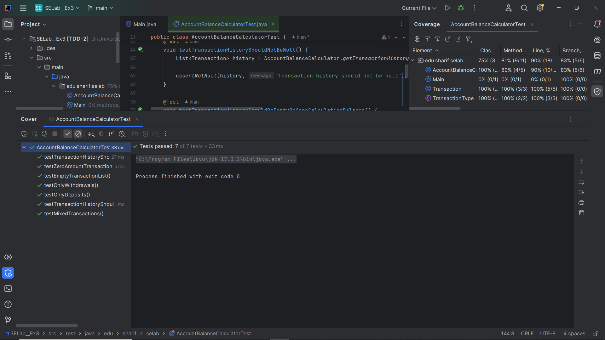
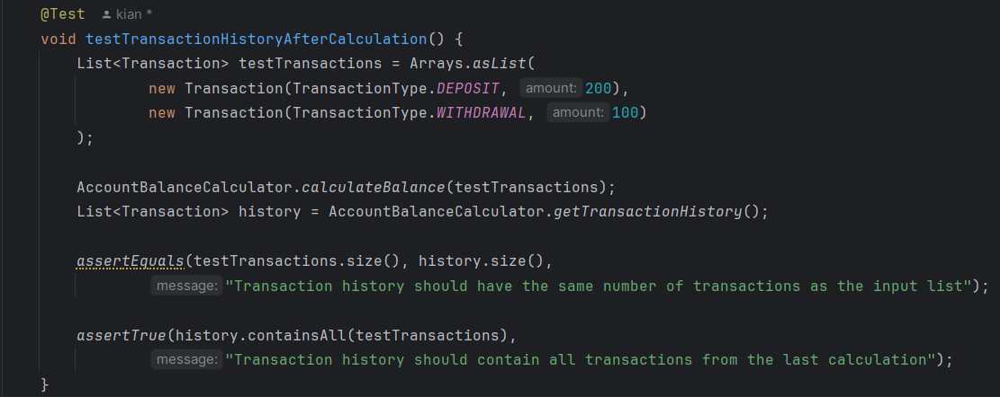
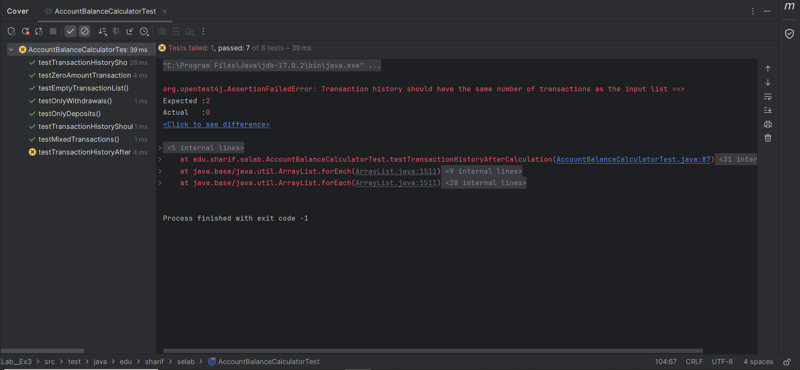
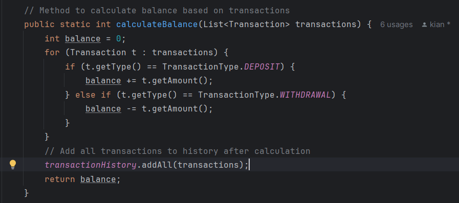
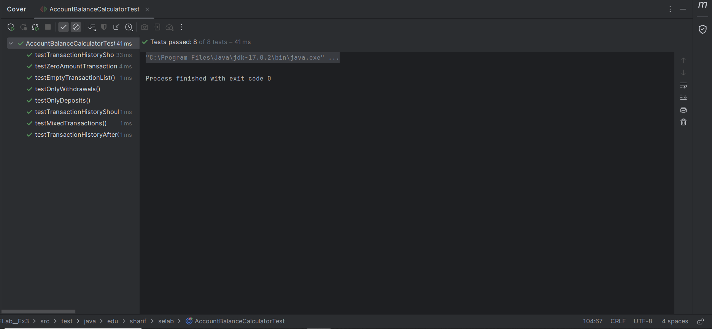
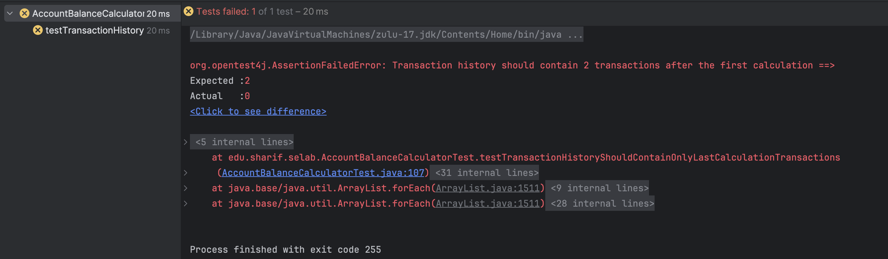
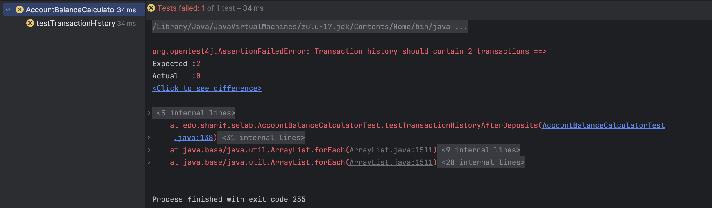
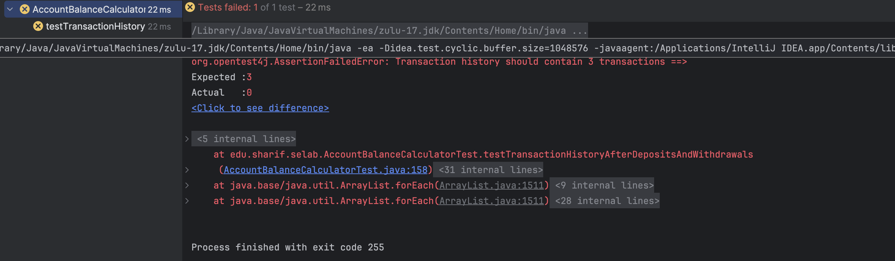
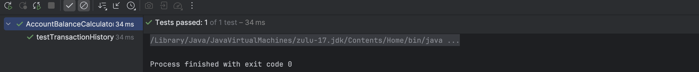
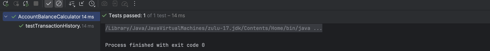

# مدیریت حساب بانکی

## اعضای گروه

کیان ایزدپناه - 400104783

امیر محمد درخشنده - 400101153

مهدی حاجی بیگی - 99109122

## بخش اول: کشف خطا

### پرسش اول

در برنامۀ مدیریت حساب بانکی، کلاسی به نام AccountBalanceCalculator تعریف شده است که وظیفۀ محاسبۀ موجودی نهایی حساب را بر اساس لیستی از تراکنش ها دارد. این کلاس همچنین دارای یک لیست استاتیک از تاریخچۀ تراکنش‌ها می‌باشد. در پیاده‌سازی اولیه، متد calculateBalance فقط عملیات محاسبه را انجام می‌داد و هیچ تغییری در transactionHistory نمی‌داد؛ بنابراین، تاریخچه‌ی تراکنش‌ها پس از محاسبه خالی یا نامربوط باقی می‌ماند.

دلیل اصلی چنین نقصی، این است که تست‌های قبلی فقط مقدار نهایی موجودی (balance) را بررسی می‌کردند و هیچ‌کدام بررسی نمی‌کردند که آیا تاریخچۀ تراکنش‌ها به‌درستی پس از محاسبه ذخیره شده است یا نه.

برای مثال، تست‌هایی مانند testOnlyDeposits یا testMixedTransactions فقط مقدار خروجی متد calculateBalance را ارزیابی می‌کنند و کاری به محتویات getTransactionHistory() ندارند.

حتی تست‌هایی که به تاریخچه مربوط بودند (مثل testTransactionHistoryShouldBeEmptyBeforeCalculatingBalance) صرفاً وضعیت قبل از محاسبه را بررسی می‌کردند و نه بعد از آن. در نتیجه، چون بررسی صریحی برای محتوای تاریخچه پس از محاسبه وجود نداشت، این نقص عملکردی توسط تست‌ها شناسایی نشده بود. در تصویر زیر پاس شدن تمامی تست ها با وجود چنین اشکالی را می توانیم مشاهده کنیم:

---

### پرسش دوم

جهت بررسی صحت رفتار مورد انتظار، تست زیر نوشته شد:

هدف این تست آن است که بررسی کند آیا پس از فراخوانی calculateBalance، تاریخچۀ تراکنش‌ها به درستی با ورودی مطابقت دارد یا خیر. قبل از اعمال تغییرات، اجرای این تست با شکست مواجه شد که نشان داد برنامه رفتار مورد انتظار را ندارد و تاریخچه به‌روز نمی‌شود. این شکست در تصویر زیر قابل مشاهده است:

برای رفع مشکل، کد متد calculateBalance به صورت زیر اصلاح شد:

با این تغییر، همه‌ی تست‌ها، از جمله تست جدید اضافه‌شده، با موفقیت اجرا شدند. این نشان‌دهندۀ صحت عملکرد و اصلاح درست باگ بود. این اجرای موفقیت آمیز در تصویر زیر قابل مشاهده است:

---

### پرسش سوم

نوشتن تست پس از پیاده‌سازی برنامه می‌تواند باعث شود برخی رفتارهای مورد انتظار (مثل به‌روزرسانی تاریخچه تراکنش‌ها) اصلاً بررسی نشوند، چون تمرکز تست‌ها بر کدی است که وجود دارد نه بر نیازمندی واقعی. این رویکرد همچنین احتمال باقی ماندن باگ‌های منطقی را بالا می‌برد و حس کاذبی از درستی کامل سیستم ایجاد می‌کند. از طرفی، اصلاح کد برای تطابق با رفتار صحیح پس از نوشتن تست‌ها معمولاً پیچیده‌تر و پرهزینه‌تر است. تجربه‌ی این تمرین نشان داد که نوشتن تست قبل یا هم‌زمان با کدنویسی، باعث درک بهتر نیازمندی‌ها و کشف زودهنگام خطاها می‌شود. در نتیجه، کیفیت نرم‌افزار و اطمینان از صحت عملکرد آن به‌طور چشم‌گیری افزایش می‌یابد.

---

## بخش دوم: به کارگیری TDD

با خارج کردن این سه تست کامنت شده از حالت کامنت شده و اجرای هر کدام از آن‌ها، مشاهده می‌شود که هر سه fail می‌شوند:

در بخش اول، تغییراتی که در کد calculateBalance اعمال شد، باعث می‌شود که تست دوم و سوم به درستی کار کنند، ولی در تست اول، همچنان مشکل اجرا شدن داریم. برای اصلاح این تست نیز، باید مشکل اصلی کد را ریشه یابی کنیم.
در کد موجود، علت عدم ران شدن تست اول، آن است که تاریخچه تراکنش‌ها به درستی پاک نمی‌شود و برای هر محاسبه جدید، تراکنش‌ها به تاریخچه اضافه می‌شوند. برای اینکه تاریخچه تراکنش‌ها فقط شامل تراکنش‌های مربوط به محاسبه جاری باشد، باید قبل از هر محاسبه تاریخچه تراکنش‌ها پاک شود. در نتیجه، کافیست در AccountBalanceCalculator، دستور transactionHistory.clear(); را اضافه کنیم که این تاریخچه ابتدا پاک شود و سپس، ادامه کد اجرا شود.

با اعمال این تغییر، مشاهده می‌شود که هر سه تست، به درستی ران می‌شوند:

حال به سراغ پرسش ها خواهیم رفت:

---

### پرسش چهارم
