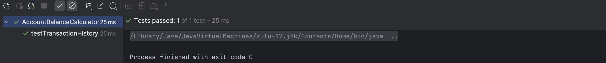

# مدیریت حساب بانکی

## اعضای گروه

کیان ایزدپناه - 400104783

امیر محمد درخشنده - 400101153

مهدی حاجی بیگی - 99109122

## بخش اول: کشف خطا

### پرسش اول

در برنامۀ مدیریت حساب بانکی، کلاسی به نام AccountBalanceCalculator تعریف شده است که وظیفۀ محاسبۀ موجودی نهایی حساب را بر اساس لیستی از تراکنش ها دارد. این کلاس همچنین دارای یک لیست استاتیک از تاریخچۀ تراکنش‌ها می‌باشد. در پیاده‌سازی اولیه، متد calculateBalance فقط عملیات محاسبه را انجام می‌داد و هیچ تغییری در transactionHistory نمی‌داد؛ بنابراین، تاریخچه‌ی تراکنش‌ها پس از محاسبه خالی یا نامربوط باقی می‌ماند.

دلیل اصلی چنین نقصی، این است که تست‌های قبلی فقط مقدار نهایی موجودی (balance) را بررسی می‌کردند و هیچ‌کدام بررسی نمی‌کردند که آیا تاریخچۀ تراکنش‌ها به‌درستی پس از محاسبه ذخیره شده است یا نه.

برای مثال، تست‌هایی مانند testOnlyDeposits یا testMixedTransactions فقط مقدار خروجی متد calculateBalance را ارزیابی می‌کنند و کاری به محتویات getTransactionHistory() ندارند.

حتی تست‌هایی که به تاریخچه مربوط بودند (مثل testTransactionHistoryShouldBeEmptyBeforeCalculatingBalance) صرفاً وضعیت قبل از محاسبه را بررسی می‌کردند و نه بعد از آن. در نتیجه، چون بررسی صریحی برای محتوای تاریخچه پس از محاسبه وجود نداشت، این نقص عملکردی توسط تست‌ها شناسایی نشده بود. در تصویر زیر پاس شدن تمامی تست ها با وجود چنین اشکالی را می توانیم مشاهده کنیم:

---

### پرسش دوم

جهت بررسی صحت رفتار مورد انتظار، تست زیر نوشته شد:

هدف این تست آن است که بررسی کند آیا پس از فراخوانی calculateBalance، تاریخچۀ تراکنش‌ها به درستی با ورودی مطابقت دارد یا خیر. قبل از اعمال تغییرات، اجرای این تست با شکست مواجه شد که نشان داد برنامه رفتار مورد انتظار را ندارد و تاریخچه به‌روز نمی‌شود. این شکست در تصویر زیر قابل مشاهده است:

برای رفع مشکل، کد متد calculateBalance به صورت زیر اصلاح شد:

با این تغییر، همه‌ی تست‌ها، از جمله تست جدید اضافه‌شده، با موفقیت اجرا شدند. این نشان‌دهندۀ صحت عملکرد و اصلاح درست باگ بود. این اجرای موفقیت آمیز در تصویر زیر قابل مشاهده است:

---

### پرسش سوم

نوشتن تست پس از پیاده‌سازی برنامه می‌تواند باعث شود برخی رفتارهای مورد انتظار (مثل به‌روزرسانی تاریخچه تراکنش‌ها) اصلاً بررسی نشوند، چون تمرکز تست‌ها بر کدی است که وجود دارد نه بر نیازمندی واقعی. این رویکرد همچنین احتمال باقی ماندن باگ‌های منطقی را بالا می‌برد و حس کاذبی از درستی کامل سیستم ایجاد می‌کند. از طرفی، اصلاح کد برای تطابق با رفتار صحیح پس از نوشتن تست‌ها معمولاً پیچیده‌تر و پرهزینه‌تر است. تجربه‌ی این تمرین نشان داد که نوشتن تست قبل یا هم‌زمان با کدنویسی، باعث درک بهتر نیازمندی‌ها و کشف زودهنگام خطاها می‌شود. در نتیجه، کیفیت نرم‌افزار و اطمینان از صحت عملکرد آن به‌طور چشم‌گیری افزایش می‌یابد.
---

## بخش دوم: به کارگیری TDD

با خارج کردن این سه تست کامنت شده از حالت کامنت شده و اجرای هر کدام از آن‌ها، مشاهده می‌شود که هر سه fail می‌شوند:

ریشه اصلی اشکالاتی که در اجرای تست ها وجود دارد را جداگانه بیان می‌کنیم:

1. تست اول: علت عدم اجرای این تست، آن است که تاریخچه تراکنش‌ها در هر محاسبه جدید پاک نمی‌شود، بنابراین، تست فیل می‌شود.
2. تست دوم: این تست، به علت آن که هیچ تراکنشی به تاریخچه افزوده نمی‌شود، فیل می‌شود.
3. مشابه مورد دوم است.

در بخش اول، تغییراتی که در کد calculateBalance اعمال شد، باعث می‌شود که تست دوم و سوم به درستی کار کنند، ولی در تست اول، همچنان مشکل اجرا شدن داریم. برای اصلاح این تست نیز، باید مشکل اصلی کد را ریشه یابی کنیم.
در کد موجود، علت عدم ران شدن تست اول، آن است که تاریخچه تراکنش‌ها به درستی پاک نمی‌شود و برای هر محاسبه جدید، تراکنش‌ها به تاریخچه اضافه می‌شوند. برای اینکه تاریخچه تراکنش‌ها فقط شامل تراکنش‌های مربوط به محاسبه جاری باشد، باید قبل از هر محاسبه تاریخچه تراکنش‌ها پاک شود. در نتیجه، کافیست در AccountBalanceCalculator، دستور transactionHistory.clear(); را اضافه کنیم که این تاریخچه ابتدا پاک شود و سپس، ادامه کد اجرا شود.

با اعمال این تغییر، مشاهده می‌شود که هر سه تست، به درستی ران می‌شوند:

حال به سراغ پرسش ها خواهیم رفت:

---

### پرسش چهارم

چند مورد را می‌توان به عنوان پاسخ این پرسش در نظر گرفت که مهم ترین آن‌ها، آن است که نوشتن تست، پیش از نوشتن کد، می‌تواند مشخص کند که عملکرد توابعی که قرار است نوشته بشوند، دقیقا باید به چه صورتی باشد. به عبارتی، بیان می‌کنیم که کدی که میخواهیم بنویسیم، چه خروجی ای باید داشته باشد و کد مورد نظر، مطابق با این خواسته و تست، نوشته شود، در حالی که اگر اول کد را بزنیم و سپس تست را مشخص بکنیم، ممکن است برخی از قسمت ها پوشش داده نشوند و درصد خطا مان بالا برود.
مورد دومی که می‌توان به آن اشاره کرد، با نوشتن تست‌ها قبل از کدنویسی، مشکلات و اشکالات زودتر شناسایی شده و رفع می‌شوند که این کار منجر به کاهش هزینه‌های تعمیرات و افزایش اعتماد به کیفیت کد می‌شود. همچنین، تست‌های مرتب به تضمین عملکرد صحیح ویژگی‌ها در هر مرحله کمک می‌کند.

### پرسش پنجم
مزایا (Advantages):
افزایش کیفیت کد و کاهش خطا:

چون کد برای پاس کردن تست‌های مشخص نوشته می‌شود، احتمال اینکه کد مطابق با نیازمندی‌ها باشد بیشتر است.
تست‌ها به عنوان یک تور ایمنی (Safety Net) عمل می‌کنند؛ با هر تغییری، می‌توان تست‌ها را اجرا کرد تا مطمئن شد که تغییرات باعث ایجاد رگرسیون (Regression) یا خطاهای جدید در بخش‌های دیگر نشده‌اند. این امر به خصوص در پروژه‌های بزرگ و طولانی‌مدت بسیار ارزشمند است.
طراحی بهتر و ماژولارتر:

برای اینکه کد قابل تست باشد، معمولاً باید به واحدهای کوچک‌تر و با وابستگی‌های کمتر (Loosely Coupled) تقسیم شود. TDD توسعه‌دهندگان را مجبور می‌کند که از ابتدا به رابط‌ها (Interfaces) و قابلیت تست‌پذیری کد فکر کنند که اغلب منجر به طراحی تمیزتر و ماژولارتر می‌شود.
مستندسازی زنده (Living Documentation):

تست‌ها به صورت عملی نشان می‌دهند که هر بخش از کد چگونه باید استفاده شود و چه انتظاراتی از آن می‌رود. این مستندات همیشه به‌روز هستند، زیرا اگر تست‌ها پاس نشوند، کد کار نمی‌کند.
افزایش اعتماد به نفس توسعه‌دهندگان:

وجود مجموعه تست‌های جامع به تیم‌ها و توسعه‌دهندگان این اطمینان را می‌دهد که می‌توانند کد را تغییر دهند یا بازآرایی کنند بدون اینکه نگران شکستن ناخواسته بخش‌های دیگر سیستم باشند.
کاهش زمان اشکال‌زدایی (Debugging):

خطاها معمولاً در همان مراحل اولیه توسعه و نزدیک به زمان ایجادشان شناسایی می‌شوند، که رفع آن‌ها را بسیار ساده‌تر و کم‌هزینه‌تر می‌کند.
معایب (Disadvantages):
کندی اولیه در روند توسعه:

نوشتن تست‌ها قبل از کد، به خصوص برای کسانی که تازه با TDD شروع کرده‌اند، می‌تواند زمان‌بر باشد و باعث شود سرعت اولیه توسعه کندتر به نظر برسد. اگرچه طرفداران TDD معتقدند این زمان در بلندمدت با کاهش زمان دیباگ و نگهداری جبران می‌شود.
منحنی یادگیری (Learning Curve):

یادگیری نوشتن تست‌های خوب و موثر، خود یک مهارت است. تست‌های بد می‌توانند شکننده باشند (با کوچک‌ترین تغییر غیرمرتبطی شکست بخورند) یا پوشش ناکافی داشته باشند و حس امنیت کاذب ایجاد کنند.
نیاز به نگهداری تست‌ها:

تست‌ها خودشان کد هستند و با تغییر نیازمندی‌ها یا بازآرایی کد اصلی، نیاز به به‌روزرسانی و نگهداری دارند. اگر تست‌ها به خوبی مدیریت نشوند، می‌توانند به یک بار اضافی تبدیل شوند.
دشواری در برخی حوزه‌ها:

اعمال TDD برای برخی بخش‌ها مانند رابط کاربری (UI)، کار با پایگاه‌داده‌های پیچیده، یا سیستم‌های با وابستگی‌های خارجی زیاد، می‌تواند چالش‌برانگیزتر باشد و نیاز به ابزارها و تکنیک‌های خاصی (مانند Mocking) دارد.
احتمال تمرکز بیش از حد بر واحدهای کوچک:

گاهی تمرکز زیاد روی تست‌های واحد (Unit Tests) ممکن است باعث شود تصویر کلی سیستم و تست‌های سطح بالاتر (مانند تست‌های یکپارچه‌سازی یا End-to-End) نادیده گرفته شوند.
نیاز به نظم و انضباط تیمی:

موفقیت TDD به شدت به پایبندی و نظم تیم در پیروی از چرخه Red-Green-Refactor بستگی دارد. اگر تیم این فرآیند را به صورت ناقص انجام دهد، ممکن است مزایای آن به دست نیاید.

